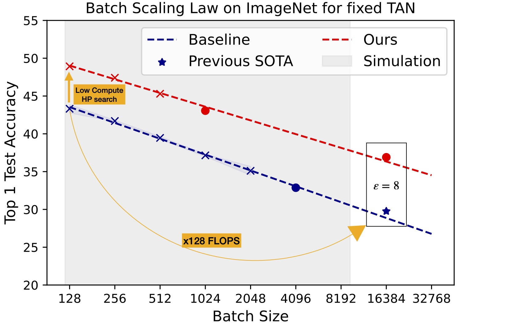

# TAN Without a Burn: Scaling Laws of DP-SGD

This repository hosts python code for the paper: [TAN Without a Burn: Scaling Laws of DP-SGD](https://arxiv.org/abs/2210.03403).

<p align="center">
  
</p>

## Installation

Via pip and anaconda

```
conda create -n "tan" python=3.9 
conda activate tan
pip install -r ./requirements.txt
```

## Quick Start

For all commands, set `max_physical_batch_size` to something that fits your GPU memory.

### WideResNet on CIFAR-10

First imitate training with $(B_0,\sigma_0,S)$ using our simple scaling law (keeping per step signal-to-noise ratio $B/\sigma = B_0/\sigma_0$ constant), at batch size $B$ and using $K$ augmentations.
Simulating at batch size 256 training with 16 augmentations for 2500 steps, noise level 3 and reference batch size 4096:

```
python cifar10.py --batch_size 256 --ref_nb_steps 2500 --ref_B 4096 --ref_noise 3 --transform 16 --data_root "path to load or store CIFAR10"
```

And the final (private but computationally expensive, $\epsilon=8$) run with:

```
python cifar10.py --batch_size 4096 --ref_nb_steps 2500 --ref_B 4096 --ref_noise 3 --transform 16 --data_root "path to load or store CIFAR10"
```

### NF-ResNet or ResNet on ImageNet

By default, the architecture is a NF-ResNet-50. It can be changed with the argument "architecture".
Simulating at batch size 256 training with 8 augmentations for 18K steps, noise level 2.5 and reference batch size 32768 with our default augmentation:

```
python imagenet.py --batch_size 256 --ref_nb_steps 18000 --ref_B 32768 --ref_noise 2.5 --transform 8 --train_path "path to load ImageNet training set" --val_path "path to load ImageNet validation or test set"
```

And the final (private but computationally expensive, $\epsilon=8$) run with:

```
python imagenet.py --batch_size 32768 --ref_nb_steps 18000 --ref_B 32768 --ref_noise 2.5 --transform 8 --train_path "path to load ImageNet training set" --val_path "path to load ImageNet validation or test set"
```

## Reference

If the code and/or paper contained in this repository were useful to you please consider citing this [work](https://arxiv.org/abs/2210.03403)
```
@article{sander2022tan,
  title={TAN Without a Burn: Scaling Laws of DP-SGD},
  author={Sander, Tom and Stock, Pierre, and Sablayrolles, Alexandre},
  journal={arXiv preprint arXiv:2210.03403},
  year={2022}
}
```

## Contributing
See the [CONTRIBUTING](https://github.com/facebookresearch/tan/CONTRIBUTING.md) for how to contribute to this library.


## License
This code is released under BSD-3-Clause, as found in the [LICENSE](https://github.com/facebookresearch/tan/LICENSE) file.
